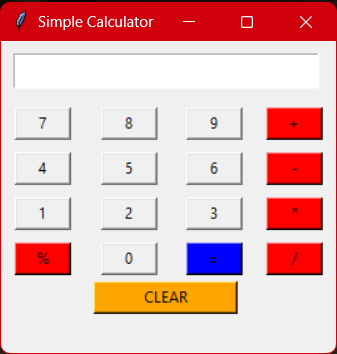
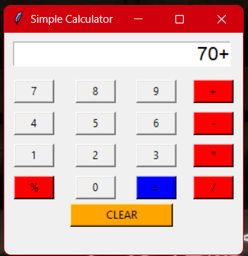
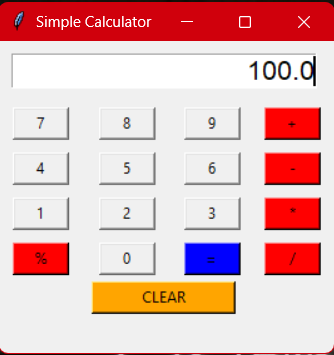

# 🧮 Simple Calculator (Tkinter GUI)

A beginner-friendly **GUI Calculator** built using **Python and Tkinter**, designed to perform basic arithmetic operations with proper error handling.

---
## 📌 Basic Details

This is an individual project created purely for learning and practice purposes.  
The main goal was to understand GUI development, event handling, and error management using Python and Tkinter.

   

---

## 🧠 Project Description

This project is a **desktop-based calculator application** developed using "Python’s Tkinter library".  
It provides a clean graphical interface for performing arithmetic operations **without using `eval()`**, ensuring better understanding of core programming logic.

---

## ❓ The Problem (That Doesn’t Exist)

Using mobile or system calculators doesn’t help beginners understand **how calculations actually work in code**.

---

## 💡 The Solution (That Nobody Asked For)

A simple GUI calculator that demonstrates:
- Button handling
- User input processing
- Conditional logic
- Error handling  
—all in a beginner-friendly way.

---

## ⚙️ Technical Details

### 🛠 Technologies / Components Used

**Software:**
- **Language:** Python 3
- **Library:** Tkinter (standard Python GUI library)
- **Tools:** VS Code / Any Python IDE

---

## 🧩 Implementation

### ✅ Requirements
1. Python **3.x**
2. Tkinter (comes pre-installed with Python)
3. Any OS (Windows / Linux / macOS)

---

### 📥 Installation Steps

1. Install Python from:
   https://www.python.org/downloads/

2. Clone the repository:
   ```bash
git clone https://github.com/LxHacky/Simple_Tkinter_Calculator.git
   
Navigate to the project folder:
cd tkinter-calculator

▶️ Run the Application:
python calculator.py

✨ Features

➕ Addition

➖ Subtraction

✖️ Multiplication

➗ Division

🔢 Modulus

❌ Error handling for:

Division by zero

Invalid input

🧠 What I Learned
Creating GUI applications using Tkinter

Using grid() layout manager

Handling button click events

Working with user input

Implementing exception handling in Python

🚀 Future Improvements:

   Add decimal point support
     
   Keyboard input support
     
   Dark mode UI
     
   Scientific calculator functions

🎬 Project Demo

   
   
    
   

❤️ Acknowledgements:

  Built as a learning project to strengthen Python GUI fundamentals.
